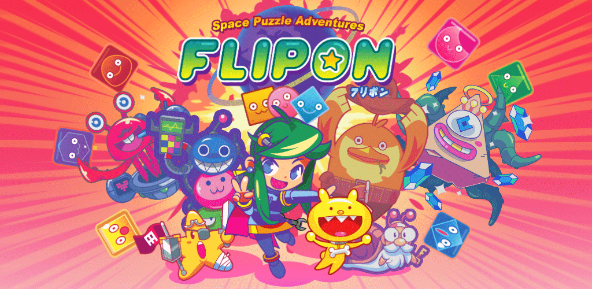
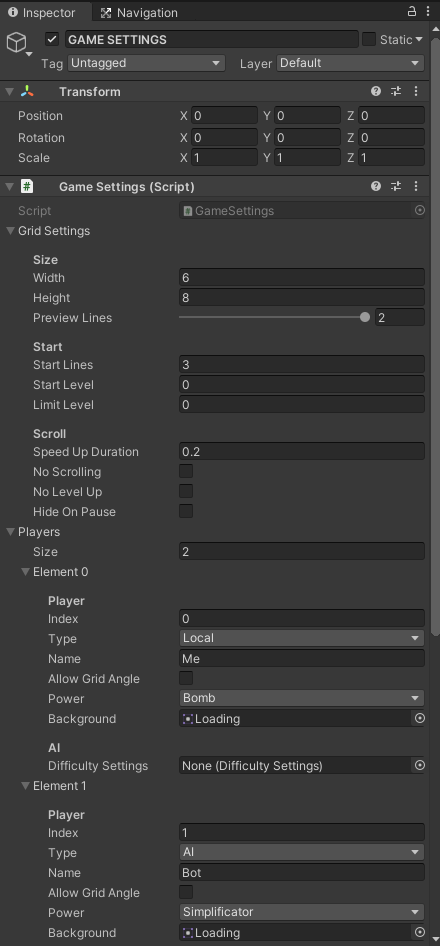

# Tiny Flipon 🚀

An open-source minimalist but playable version of [Flipon](https://www.flipon.net), my juicy fast-paced match-3 game.

Get the original game on:

- [PC](https://store.steampowered.com/app/1285020/Flipon/)
- [Nintendo Switch](https://www.nintendo.com/games/detail/flipon-switch/)
- [Android](https://play.google.com/store/apps/details?id=com.pid.flipon) 
- [iOS](https://apps.apple.com/us/app/flipon/id1535461342)

The game was made by me (dev, project manager, release), Aurélien Regard (2D art), Yoann Bazoge (UI/UX), Swann Ménage (sound design) and Zander Noriega (music).

## What is Tiny Flipon

Tiny Flipon is a playable Unity project containing the core gameplay of Flipon. Most of the source code is a direct copy of what is in the complete game.

What is included?

- ✅ Core logic: Grid of blocks, move horizontally, combo, chain
- ✅ Unity project
- ✅ Objectives 
- ✅ Local multiplayer logic
- ✅ "AI" 
- ✅ Touch controls
- ✅ Dynamic UI and screen split
- ✅ Unit tests for gameplay

What is not included?

- ❌ Assets (no sprites, no backgrounds, no sounds, no FXs) - no copyrighted files!
- ❌ Third-party premium plugins (Odin Inspector, InControl, etc)
- ❌ Audio
- ❌ Gamepad support 
- ❌ Menus, UI
- ❌ Dialog system
- ❌ i18n and texts
- ❌ Custom editor tools
- ❌ Console and mobile ports

## Code Architecture & quality 

**THIS IS A FAR FROM PERFECT CODEBASE** and it doesn't matter. I'm not releasing it because I want to show my C# skill, instead I want to show what a released game looks like inside: complex, some dead code (but some dead code is link to the "tiny" part), lots of code that could be refactored, scrap from previous projects... 

Now, with Flipon I wanted to avoid using Unity's scene as much as possible except for the UI. That's why the `Game` scene doesn't display anything when not running: everything is created on Play.

I also wanted to have a testable independant C# project for the `Core`. That's why you have `Block` (core) and `BlockScript` (Unity MonoBehaviour).
Turns out it wasn't a great idea, but I did manage to have Unit tests for most of that part. Also it could be reused in ahything else (ML, Flipon 99 players online, whatever).

BUT in the end a lot of game logic also happen in `PonGameScript` and `GridScript` (like chain detection), so it is far from perfect.

## How to run

Open the project in [Unity](unity3d.com/) (2019.4.0f18).

Open the `Game` scene.

Play. It should run.

Now you can tweak the `GAME SETTINGS` GameObject to change players, objectives, grid size, speed, etc.

## Question? Join the discord

Join the [official Flipon discord](https://discord.gg/7jFZ2fC) if you have any question about the game or the code, it's your best chance to get a quick answer. 

## Contributing

The gameplay code is this repository is the same than in the game.
If you want to make a significant modification or addition, I may or may not add it in the final game. If so, I'll indeed properly credits your work.

There's a `.DotSettings` file for Rider/Omnisharp if you want to follow the coding style of the prokject.

Note: I use as much Gitmoji as possible my commit messages.

